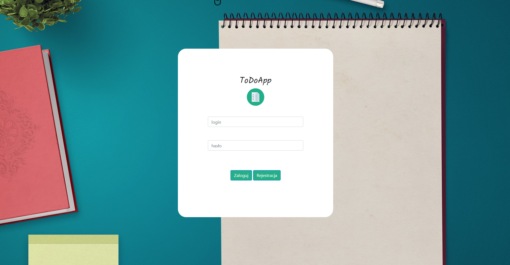
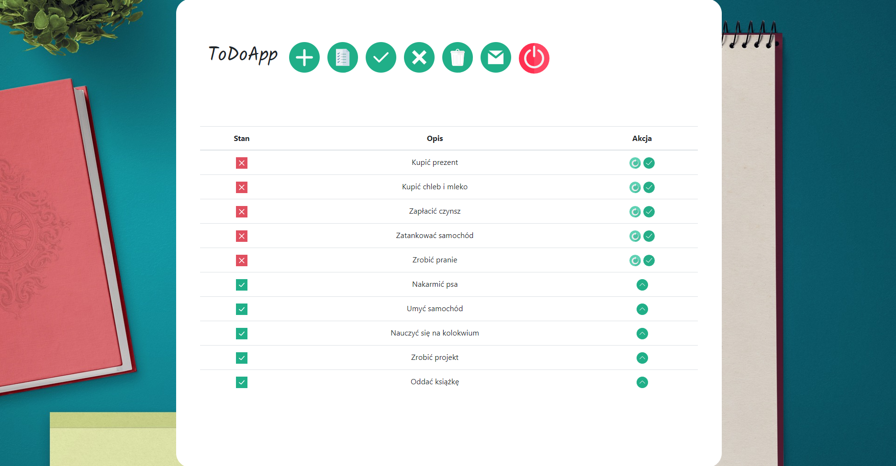

# ToDoApp 

 
 
 

<b>What is ToDoApp?</b>

<b>ToDoApp</b> is an <b><i>Spring Boot</i></b> application that allows users to manage tasks to do. The user can add any number of tasks, modify tasks and send unfinished tasks to his email.

 

<b>Database</b>

ToDoApp uses the <b><i>mysql</b></i> database. The database contains 4 tables: role, user, task and user_roles. The schema name is <b>todoapp_database</b>. CRUD operations are provided by <b><i>JpaRepository</b></i>. The user's password is hashed using <b><i>BCrypt</b></i>.

 

<b>Spring Security</b>

ToDoApp uses <b><i>Spring Security</i></b> to manage application security. The <b>SecurityConfig</b> class defines the user authentication method, login and registration process, role management, and BCrypt encoding settings. The <b>CustomAuthenticationSuccessHandler</b> class authenticates the login process.

 

<b>Validation</b>

ToDoApp supports validation when a new user is registered. The validator checks if all required fields are filled in, the correctness of the email address, etc. Classes and interfaces responsible for validation are in the <b>validation package</b>.

 

<b>Sending Emails</b>

ToDoApp uses <b><i>spring-boot-starter-mail</b></i> to enable sending emails with unfinished tasks to the logged in user.

 

<b>Server</b>

By default, the application uses the embedded <b>Tomcat</b> server, which is provided by the <b><i>spring-boot-starter-web</b></i> dependency, so you don't need an external server.

 

<b>Template engine, styles and pictures</b>

ToDoApp uses <b><i>Thymeleaf</b></i> to manage templates. All images were downloaded from <a href="https://www.flaticon.com/home">flaticon</a>. <b><i>Bootstrap</b></i> was used to style the application. Below are several screenshots presenting the appearance of the application:

 
 

 

